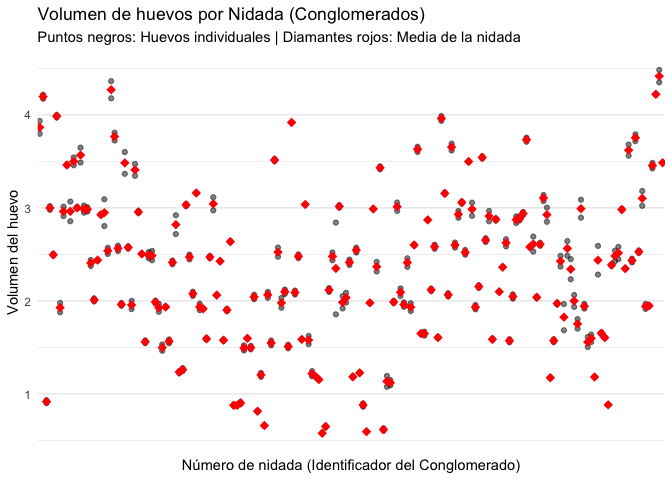

Conglomerados
================
Mia Wayar
2025-12-04

``` r
library(ggplot2)
library(dplyr)
library(SDaA)  
data(coots)
```

``` r
# Resumen básico
summary(coots)
```

    ##      clutch           csize            length         breadth     
    ##  Min.   :  1.00   Min.   : 5.000   Min.   :41.00   Min.   :28.32  
    ##  1st Qu.: 46.75   1st Qu.: 8.750   1st Qu.:47.40   1st Qu.:33.00  
    ##  Median : 92.50   Median :10.000   Median :48.55   Median :33.59  
    ##  Mean   : 92.50   Mean   : 9.554   Mean   :48.63   Mean   :33.63  
    ##  3rd Qu.:138.25   3rd Qu.:11.000   3rd Qu.:50.01   3rd Qu.:34.35  
    ##  Max.   :184.00   Max.   :13.000   Max.   :53.07   Max.   :36.25  
    ##      volume       tmt     
    ##  Min.   :0.573   no :262  
    ##  1st Qu.:1.680   yes:106  
    ##  Median :2.394            
    ##  Mean   :2.333            
    ##  3rd Qu.:2.945            
    ##  Max.   :4.481

``` r
# Cálculo de estadísticas por nidada (Cluster) para el gráfico
resumen_nidadas <- coots %>%
  group_by(clutch) %>%
  summarise(
    media_nidada = mean(volume),
    n_huevos = n()
  )

# Gráfica A: Puntos individuales y medias por nidada
ggplot(coots, aes(x = as.factor(clutch), y = volume)) +
  geom_point(alpha = 0.5, size = 1.5) + # Huevos individuales
  geom_point(data = resumen_nidadas, aes(y = media_nidada), 
             color = "red", shape = 18, size = 3) + # Media de la nidada
  labs(
    title = "Volumen de huevos por Nidada (Conglomerados)",
    subtitle = "Puntos negros: Huevos individuales | Diamantes rojos: Media de la nidada",
    x = "Número de nidada (Identificador del Conglomerado)",
    y = "Volumen del huevo"
  ) +
  theme_minimal() +
  theme(axis.text.x = element_blank(), panel.grid.major.x = element_blank())
```

<!-- -->

``` r
# Cálculo de totales por nidada
datos_conglomerados <- coots %>%
  group_by(clutch) %>%
  summarise(
    yi = sum(volume), # Suma del volumen en la nidada i
    mi = n()          # Número de huevos medidos en la nidada i
  )

# Totales globales
sum_yi <- sum(datos_conglomerados$yi) # Suma total de volumen en la muestra
sum_mi <- sum(datos_conglomerados$mi) # Total de huevos en la muestra

# Estimación Puntual (Media)
mu_hat <- sum_yi / sum_mi

cat("El promedio poblacional estimado del volumen del huevo es:", round(mu_hat, 4))
```

    ## El promedio poblacional estimado del volumen del huevo es: 2.3334

``` r
# 1. Definir variables
n <- nrow(datos_conglomerados)      # Número de nidadas (clusters)
m_bar <- mean(datos_conglomerados$mi) # Promedio de huevos por nidada

# 2. Calcular los residuos al cuadrado (variabilidad entre clusters)
# Fórmula interna: (Total_Cluster - (Media_Global * Tamaño_Cluster))^2
datos_conglomerados <- datos_conglomerados %>%
  mutate(
    residuos_sq = (yi - mu_hat * mi)^2
  )

suma_residuos <- sum(datos_conglomerados$residuos_sq)

# 3. Calcular la Varianza del estimador
var_estimador <- (1 / (n * (n - 1) * m_bar^2)) * suma_residuos

# 4. Calcular el Error Estándar (Raíz cuadrada de la varianza)
se_estimador <- sqrt(var_estimador)

# Mostrar resultados
cat("Resultados Finales:\n")
```

    ## Resultados Finales:

``` r
cat("Número de nidadas (n):", n, "\n")
```

    ## Número de nidadas (n): 184

``` r
cat("Estimación media del volumen:", round(mu_hat, 4), "\n")
```

    ## Estimación media del volumen: 2.3334

``` r
cat("Error Estándar (SE):", round(se_estimador, 4), "\n")
```

    ## Error Estándar (SE): 0.0618

``` r
cat("Intervalo de Confianza (95% approx): [", 
    round(mu_hat - 1.96*se_estimador, 3), ", ", 
    round(mu_hat + 1.96*se_estimador, 3), "]\n")
```

    ## Intervalo de Confianza (95% approx): [ 2.212 ,  2.455 ]
