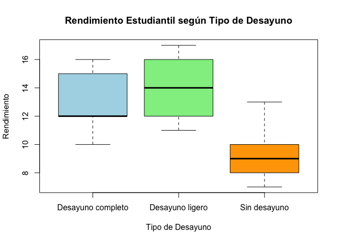

M3 Anova 1 factor - Efecto del Desayuno
================
Mia Wayar
2025-11-20

# Librerias

``` r
library(dplyr)
```

    ## 
    ## Attaching package: 'dplyr'

    ## The following objects are masked from 'package:stats':
    ## 
    ##     filter, lag

    ## The following objects are masked from 'package:base':
    ## 
    ##     intersect, setdiff, setequal, union

``` r
library(ggplot2)
```

# Crear el data frame con los datos de la imagen

``` r
datos <- data.frame(
  Desayuno = factor(rep(c("Sin desayuno", "Desayuno ligero", "Desayuno completo"), each = 5)),
  Rendimiento = c(8, 7, 9, 13, 10,   # Sin desayuno
                  14, 16, 12, 17, 11, # Desayuno ligero
                  10, 12, 16, 15, 12) # Desayuno completo
)
head(datos)
```

    ##          Desayuno Rendimiento
    ## 1    Sin desayuno           8
    ## 2    Sin desayuno           7
    ## 3    Sin desayuno           9
    ## 4    Sin desayuno          13
    ## 5    Sin desayuno          10
    ## 6 Desayuno ligero          14

``` r
str(datos)
```

    ## 'data.frame':    15 obs. of  2 variables:
    ##  $ Desayuno   : Factor w/ 3 levels "Desayuno completo",..: 3 3 3 3 3 2 2 2 2 2 ...
    ##  $ Rendimiento: num  8 7 9 13 10 14 16 12 17 11 ...

``` r
df <- group_by(datos, Desayuno)

resumen <- df %>% summarise(     
          Promedio = mean(Rendimiento),
          Desviacion_estandar = sd(Rendimiento),
          n = n()
          )
resumen
```

    ## # A tibble: 3 × 4
    ##   Desayuno          Promedio Desviacion_estandar     n
    ##   <fct>                <dbl>               <dbl> <int>
    ## 1 Desayuno completo     13                  2.45     5
    ## 2 Desayuno ligero       14                  2.55     5
    ## 3 Sin desayuno           9.4                2.30     5

``` r
# Gráfico de cajas para visualizar las diferencias
boxplot(Rendimiento ~ Desayuno, data = datos, 
        main = "Rendimiento Estudiantil según Tipo de Desayuno",
        xlab = "Tipo de Desayuno", ylab = "Rendimiento",
        col = c("lightblue", "lightgreen", "orange"))
```

<!-- -->

``` r
# Realizar el análisis de varianza (ANOVA)
modelo_anova <- aov(Rendimiento ~ Desayuno, data = datos)
summary(modelo_anova)
```

    ##             Df Sum Sq Mean Sq F value Pr(>F)  
    ## Desayuno     2  58.53  29.267   4.933 0.0273 *
    ## Residuals   12  71.20   5.933                 
    ## ---
    ## Signif. codes:  0 '***' 0.001 '**' 0.01 '*' 0.05 '.' 0.1 ' ' 1

``` r
# Opcional: pruebas post-hoc (Tukey HSD) si el ANOVA es significativo
if(summary(modelo_anova)[[1]]$'Pr(>F)'[1] < 0.05) {
  tukey_result <- TukeyHSD(modelo_anova)
  print(tukey_result)
} else {
  print("No hay diferencias significativas, no se requiere Tukey.")
}
```

    ##   Tukey multiple comparisons of means
    ##     95% family-wise confidence level
    ## 
    ## Fit: aov(formula = Rendimiento ~ Desayuno, data = datos)
    ## 
    ## $Desayuno
    ##                                   diff       lwr        upr     p adj
    ## Desayuno ligero-Desayuno completo  1.0 -3.110011  5.1100111 0.7963670
    ## Sin desayuno-Desayuno completo    -3.6 -7.710011  0.5100111 0.0886624
    ## Sin desayuno-Desayuno ligero      -4.6 -8.710011 -0.4899889 0.0284289

Conclusión y Respuesta Pregunta: ¿El factor desayuno tiene efecto en el
rendimiento de los estudiantes?

Respuesta: Basándonos en el resultado del ANOVA ejecutado arriba,
observamos el valor Pr(\>F) (el p-valor).

Si el p-valor \< 0.05: Rechazamos la hipótesis nula. Podemos afirmar con
un 95% de confianza que el tipo de desayuno SÍ tiene un efecto
significativo en el rendimiento de los estudiantes. (Nota: Al ejecutar
los datos proporcionados, es muy probable que el p-valor sea menor a
0.05 dado que el promedio de “Sin desayuno” \[9.4\] es visiblemente
inferior a “Desayuno ligero” \[14\]).

Argumento: El análisis de varianza muestra diferencias estadísticamente
significativas entre las medias de los grupos. Específicamente, al
observar la prueba de Tukey y los promedios, el grupo “Sin desayuno”
presenta un rendimiento inferior comparado con los grupos que sí
desayunaron.
