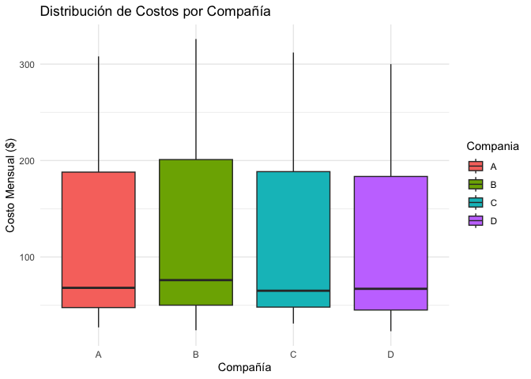

Anova 2 factores
================
Mia Wayar
2025-12-03

``` r
knitr::opts_chunk$set(echo = TRUE)
library(knitr)
library(ggplot2)
```

``` r
# Creación del DataFrame con los datos de la imagen
# Factor 1: Nivel de Uso (Bloques)
# Factor 2: Compañía (Tratamientos)
# Variable Respuesta: Costo

datos <- data.frame(
  Costo = c(27, 24, 31, 23,    
            68, 76, 65, 67,    
            308, 326, 312, 300),
  
  Nivel_Uso = factor(c(rep("Bajo", 4), rep("Medio", 4), rep("Alto", 4)),
                     levels = c("Bajo", "Medio", "Alto")),
  
  Compania = factor(rep(c("A", "B", "C", "D"), 3))
)

# Visualización de la tabla de datos
kable(datos, caption = "Datos de Costos Mensuales por Compañía y Nivel de Uso")
```

| Costo | Nivel_Uso | Compania |
|------:|:----------|:---------|
|    27 | Bajo      | A        |
|    24 | Bajo      | B        |
|    31 | Bajo      | C        |
|    23 | Bajo      | D        |
|    68 | Medio     | A        |
|    76 | Medio     | B        |
|    65 | Medio     | C        |
|    67 | Medio     | D        |
|   308 | Alto      | A        |
|   326 | Alto      | B        |
|   312 | Alto      | C        |
|   300 | Alto      | D        |

Datos de Costos Mensuales por Compañía y Nivel de Uso

``` r
ggplot(datos, aes(x=Compania, y=Costo, fill=Compania)) +
  geom_boxplot() +
  theme_minimal() +
  labs(title = "Distribución de Costos por Compañía",
       y = "Costo Mensual ($)",
       x = "Compañía")
```

<!-- -->

``` r
modelo_anova <- aov(Costo ~ Nivel_Uso + Compania, data = datos)

# tabla ANOVA
tabla_anova <- summary(modelo_anova)
tabla_anova
```

    ##             Df Sum Sq Mean Sq  F value   Pr(>F)    
    ## Nivel_Uso    2 189335   94668 2351.990 2.07e-09 ***
    ## Compania     3    222      74    1.841     0.24    
    ## Residuals    6    242      40                      
    ## ---
    ## Signif. codes:  0 '***' 0.001 '**' 0.01 '*' 0.05 '.' 0.1 ' ' 1

``` r
# Extraemos el p-valor de la compañía
p_valor_compania <- summary(modelo_anova)[[1]]["Compania", "Pr(>F)"]

cat("**Resultado del Análisis:**\n\n")
```

    ## **Resultado del Análisis:**

``` r
cat(paste("El valor P para las Compañías es:", format(p_valor_compania, scientific = FALSE), "\n\n"))
```

    ## El valor P para las Compañías es: 0.2403784

``` r
if(p_valor_compania < 0.05){
  cat("Dado que el valor P es **menor** que 0.05, **rechazamos la hipótesis nula**. \n\n")
  cat("**Conclusión:** Con un 95% de confianza, existe evidencia estadística suficiente para afirmar que **SÍ existen diferencias significativas** en los costos promedio cobrados por las diferentes compañías de telefonía.")
} else {
  cat("Dado que el valor P es **mayor** que 0.05, **no rechazamos la hipótesis nula**. \n\n")
  cat("**Conclusión:** Con un 95% de confianza, **NO existe evidencia estadística suficiente** para afirmar que las compañías cobren costos promedios diferentes. Las diferencias observadas pueden deberse al azar.")
}
```

    ## Dado que el valor P es **mayor** que 0.05, **no rechazamos la hipótesis nula**. 
    ## 
    ## **Conclusión:** Con un 95% de confianza, **NO existe evidencia estadística suficiente** para afirmar que las compañías cobren costos promedios diferentes. Las diferencias observadas pueden deberse al azar.
